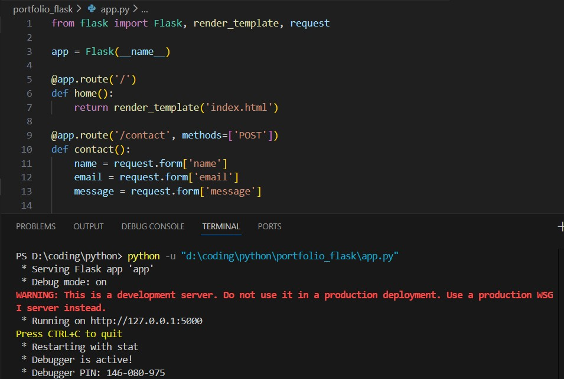
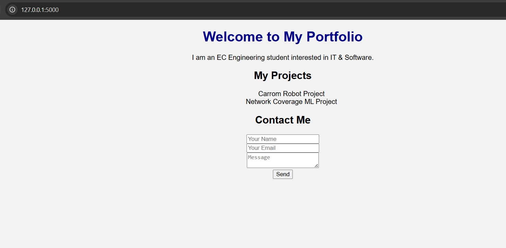

# Flask Portfolio Website

This project is a personal portfolio website built using Flask.

# Features:
- Personal portfolio page
- Contact form
- Flask routing
- HTML CSS styling

# Tools Used:
Python, Flask, HTML, CSS

# How to Run:
1. Install Flask
2. Run app.py
3. Open http://127.0.0.1:5000

## Output Screenshot

